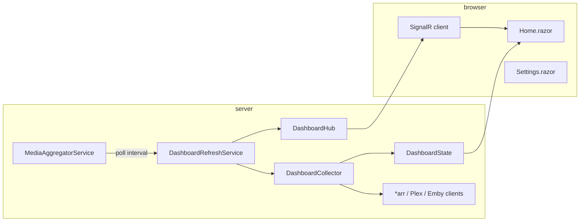

# Architecture

ArrDash is a single-process **Blazor Server** app. The browser holds a SignalR circuit; UI events and renders run on the server. Dashboard data is fetched in the background and pushed to clients when it changes.

## High-level flow



## Project layout

```
ArrDash/
├── src/ArrDash/                 # Main web app
│   ├── Components/
│   │   ├── Pages/               # Home (dashboard), Settings, Error
│   │   ├── Panels/              # DownloadPanel, NowPlayingPanel
│   │   ├── Layout/              # MainLayout (app bar, nav)
│   │   └── Shared/              # Reusable UI (metrics, status bar, pickers)
│   ├── Services/
│   │   ├── Clients/             # HTTP clients per upstream service
│   │   ├── DashboardCollector.cs
│   │   ├── DashboardRefreshService.cs
│   │   ├── DashboardState.cs
│   │   ├── LayoutPreferencesService.cs
│   │   ├── ThemeBuilder.cs / ThemeService.cs
│   │   ├── PosterProxyService.cs
│   │   └── HostSystemMetricsService.cs
│   ├── Models/                  # DTOs and UserLayoutPreferences
│   ├── Configuration/           # MediaServiceOptions binding
│   ├── Hubs/DashboardHub.cs
│   └── Program.cs               # DI, routes, API maps
├── tests/ArrDash.Tests/         # xUnit tests
├── docs/                        # This documentation
├── Dockerfile
└── docker-compose.example.yml
```

## Core services

### MediaAggregatorService

Hosted background service. On startup it runs one full refresh, then loops:

1. If **Manual refresh only** is off → call `DashboardRefreshService.RefreshAsync`
2. Sleep for **poll interval** (settings override or `POLL_INTERVAL_SECONDS` env, default 30s)

### DashboardRefreshService

1. `DashboardCollector.CollectAsync` — parallel fetches from all enabled services
2. `DashboardState.Update(snapshot)` — in-memory current snapshot
3. SignalR `DashboardUpdated` broadcast to all connected browsers

### DashboardCollector

Builds a `DashboardSnapshot`:

| Field | Source |
|-------|--------|
| `RecentTv` | Sonarr history → batched by season, episode badges |
| `RecentMovies` | Radarr history |
| `RecentAudiobooks` | Chaptarr + AudioBookShelf (merge mode configurable) |
| `RecentMusic` | Lidarr history |
| `ActiveSessions` | Plex + Emby (filtered by settings) |
| `Services` | Per-client health (configured, online, error, version) |
| `Host` | CPU / memory / disk from `/proc` and `DriveInfo` |
| `UpdatedAt` | UTC timestamp of this collection pass |

Disabled services (Settings → Services) are skipped and reported as disabled.

### LayoutPreferencesService

Loads/saves `user-layout.json` under `ARRDASH_CONFIG_PATH` (default `/config`).

- **Live preview** — `SetPreview` applies unsaved changes to the running app
- **Save** — writes JSON; **Discard** — reloads from disk
- Settings changes trigger a dashboard refresh so lists reflect new limits/filters

### ServiceSecretsStore

Persists API keys in `service-secrets.json`. `MediaServiceOptionsAccessor` merges:

1. `appsettings.json`
2. Environment variables
3. Saved secrets (highest priority for keys)

Settings **Test connection** uses form values via `ServiceCredentialsPreviewService` without saving.

### PosterProxyService

Same-origin proxy so browsers never load poster URLs from LAN IPs or cross-origin *arr hosts (avoids mixed content and Local Network Access prompts).

Routes are mapped in `Program.cs` under `/api/poster/...` and `/api/thumbnail/...`.

### HostSystemMetricsService

Reads Linux `/proc/stat` and `/proc/meminfo` (configurable via `ARRDASH_PROC_ROOT`). Disk usage uses `DriveInfo` on `ARRDASH_DISK_PATH`.

## UI structure

### Dashboard (`Home.razor`)

- Hero strip (optional): title, last refresh, manual refresh button
- Server metrics bar (optional)
- Panels in user-defined order: Now Playing, Recent TV/Movies/Audiobooks/Music
- Service status bar (optional)

Connects to SignalR on first render; falls back to HTTP refresh if hub fails.

### Settings (`Settings.razor`)

Tabbed editor with sticky Save / Discard / Preview toolbar. Most changes apply immediately to preview state; Save persists layout + secrets.

### Kiosk mode

Activated via layout query or auto-kiosk setting. Supports panel rotation, screensaver on idle, large Now Playing, hidden hero.

## Data models

Key types live in `Models/DashboardModels.cs` and `Models/SettingsModels.cs`:

- `DownloadItem` — one recent import/grab with poster, quality, episode metadata, deep links
- `ActiveSession` — Plex/Emby playback row
- `ServiceHealth` — status chip data
- `UserLayoutPreferences` — full settings graph (serialized to JSON)

## Technology choices

| Choice | Reason |
|--------|--------|
| Blazor Server | Fast iteration, no WASM download, good for LAN dashboard |
| MudBlazor | Consistent Material-style UI |
| Singleton collectors | One poll cycle shared across all users |
| SignalR | Push updates without polling from every browser |
| JSON config files | Simple backup/restore on Unraid appdata |

## Extension points

To add a new *arr or media source:

1. Add client in `Services/Clients/`
2. Register `HttpClient` in `Program.cs`
3. Wire into `DashboardCollector` and service health list
4. Add credential definition in `ServiceCredentialCatalog`
5. Add panel or extend existing panel as appropriate
